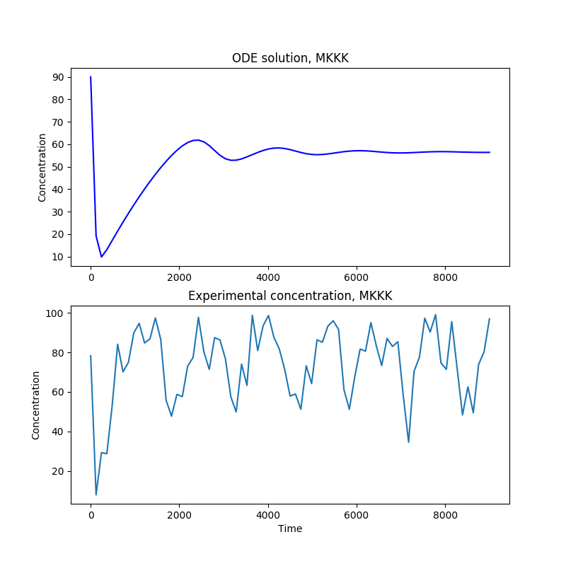
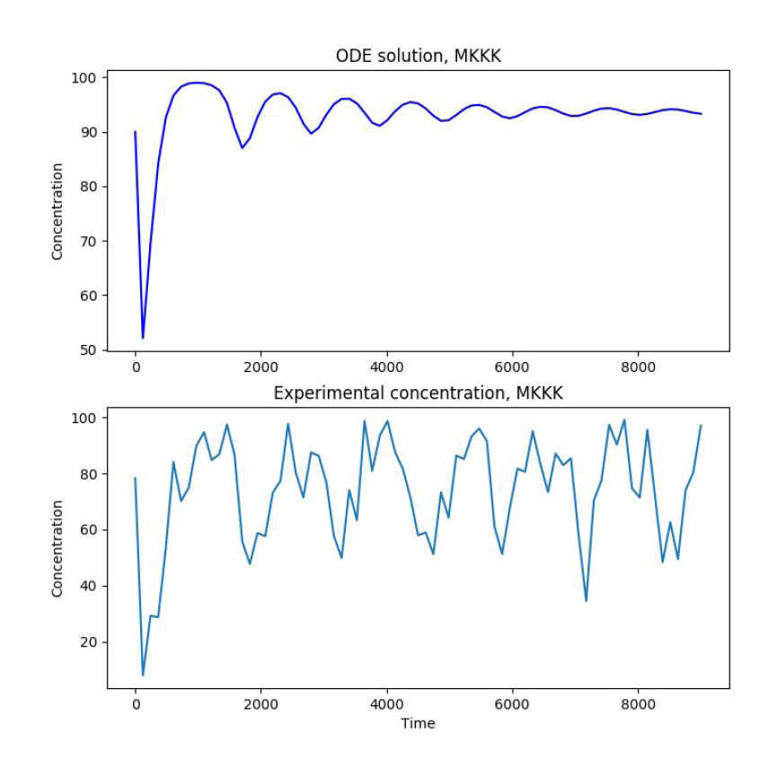
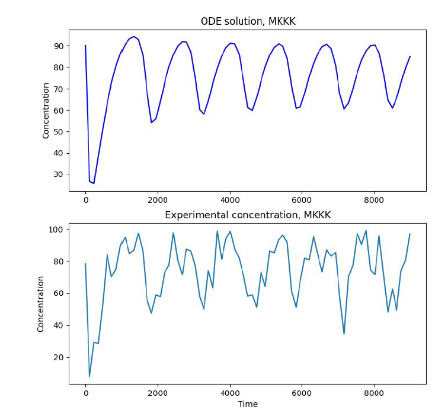
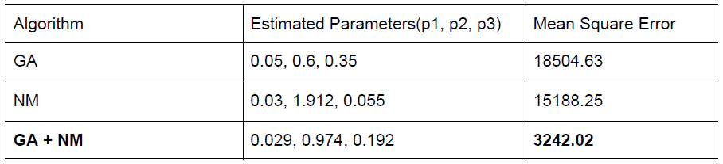

# Kinetic Parameter Estimation 

## This code implements a parameter estimation pipeline for an MAPK cascade

Two algorithms are implmented - A genetic algorithm and the Nelder-Mead Simplex.
These can be used in conjunction for any generic parameter estimation problem.

## Results using only Nelder-Mead simplex or only GA

Results using only Nelder-Mead           |  Results using only GA
:-------------------------:|:-------------------------:
  |  

## Results using both algorithms

While the Nelder-Mead simplex is a good local search heuristic, Genetic Algorithms are good for global search.
It then makes sense to apply these in sucession, getting global estimates from the Genetic Algorithm and fine-tuning these with the Nelder-Mead simplex

Results using only Nelder-Mead           |  Results using only GA
:-------------------------:|:-------------------------:
  |  

<figure>
  
  <figcaption>Error for different algorithms
</figure> 
As can be seen from the image and table, this results in much better parameter estimates.
