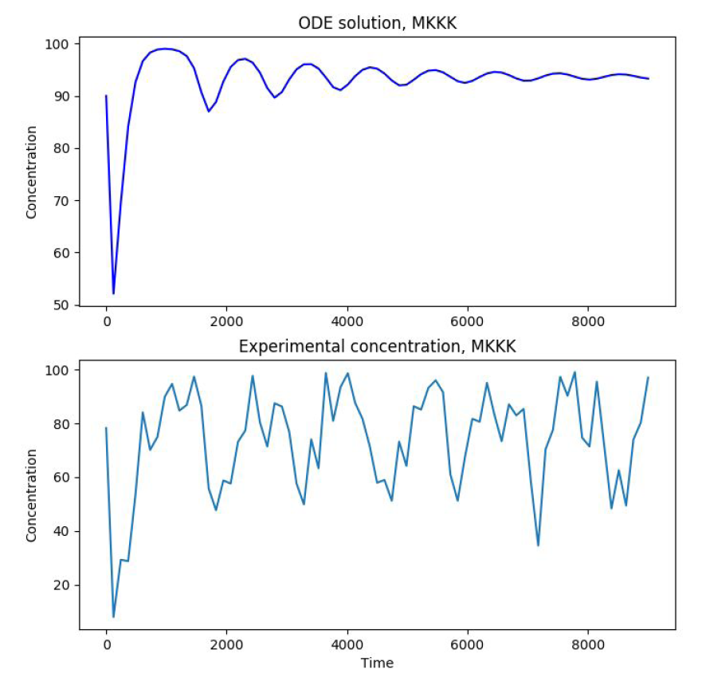

# Global + Local search for Kinetic Parameter Estimation 

&nbsp;

## This code implements a parameter estimation pipeline for an MAPK cascade

Two algorithms are implmented - A genetic algorithm and the Nelder-Mead Simplex.
These can be used in conjunction for any generic parameter estimation problem.

&nbsp;

## Results using only Nelder-Mead simplex or only GA

Results using only Nelder-Mead (Better for local search)           |  Results using only GA (Better for global search)
:-------------------------:|:-------------------------:
  |  

&nbsp;

## Results using both algorithms

While the Nelder-Mead simplex is a good local search heuristic, Genetic Algorithms are good for global search.
It then makes sense to apply these in sucession, getting global estimates from the Genetic Algorithm and fine-tuning these with the Nelder-Mead simplex

Results using both Algorithms together    |  Results using both Algorithms together  
:-------------------------:|:-------------------------:
  |  

&nbsp;

## Performance of the three search heuristics

<figure>
  
  <figcaption>Error for different algorithms
</figure> 

&nbsp; 

As can be seen from the images and table, GA for global search followed by NM for local search gives most accurate parameter estimates.
